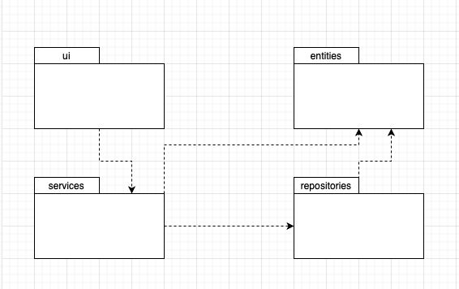
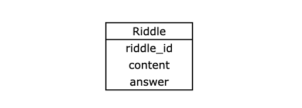
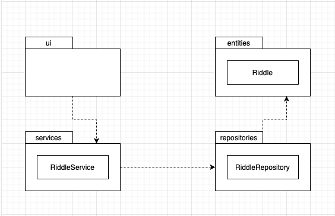
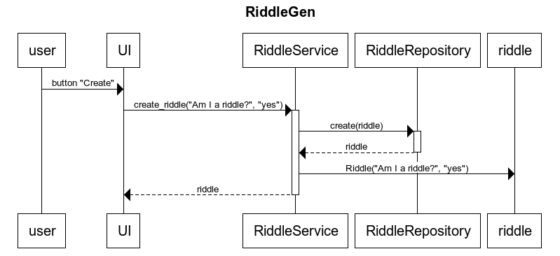

# Arkkitehtuurikuvaus

## Rakenne ja sovelluslogiikka 

### Sovelluksen koodin rakenne on seuraava:

- Pakkaus ui: käyttöliittymään liittyvä koodi
- Pakkaus services: sovelluslogiikkaan liittyvä koodi
- Pakkaus repositories: tietojen pysyväistallennukseen liittyvä koodi
- Pakkaus entities: luokka, joka kuvastaa sovelluksen käyttämää tietokohdetta

### Luokkakaavio: Riddle

- Kuvaa arvoituksen sisältöä, vastausta ja id:tä

### Sovelluslogiikka

- Sovelluksen osien suhteita kuvaava kaavio:

## Toiminnallisuudet

- Arvoituksen luominen tapahtuu hypoteettisesti painamalla "Create"-nappia: 

## Tietojen pysyväistallennus

- Sovellus tallentaa tietoa CSV-tiedostoon (riddles.csv) ja se tallentuu seuraavassa muodossa:

- ae3bcd89-cd70-4793-a840-41cff37e4ce4;What has roots as nobody sees, is taller than trees, up, up, up it goes, and yet, never grows?;Mountain

- 6bed7a15-a539-4c0d-8326-e140ebe408a8;Thirty white horses on a red hill. First they champ,then they stamp, then they stand still.;Teeth

