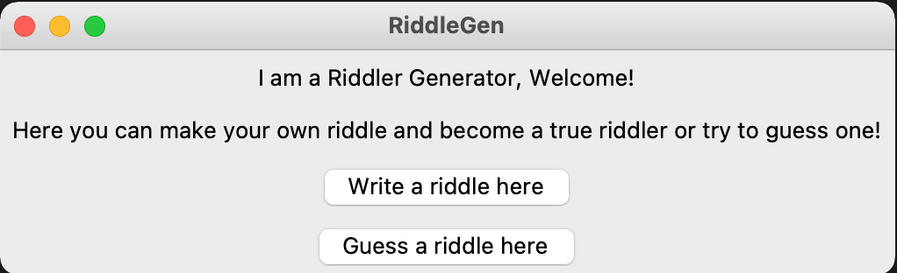
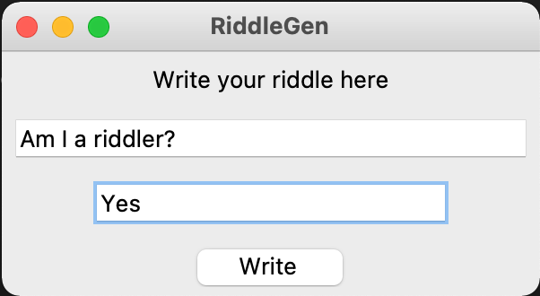
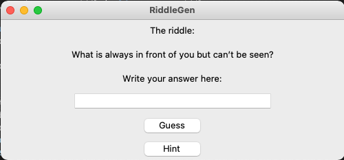
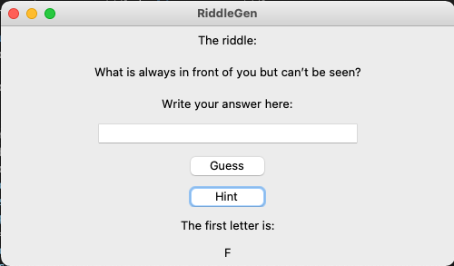
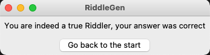
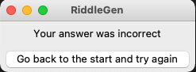

# Käyttöohje

## Ohjelman käynnistys

- Ensin asenna riippuvuudet komennolla:

```
poetry install
```

- Tämän jälkeen voit käynnistää sovelluksen komennolla:

```
poetry run invoke start
```
- Kun on suoritettu edellä mainitut komennot, aukeaa sovelluksen graafinenkäyttöliittymä



- "Write a riddle here"-napista voi siirtyä seuraavaan näkymään kirjoittamaan arvoituksen, joka tallentuu riddles.csv-tiedostoon



- "Guess a riddle here"-napista voi siirtyä seuraavaan näkymään arvaamaan arvoitusta



- Jos arvoitus on liian vaikea, on mahdollisuus saada vinkki "Hint"-napista. Nappi tulostaa käyttäjän näkymään arvoituksen ensimmäisen kirjaimen



- Jos arvoitus arvataan oikein, siirtyy näkymä seuraavaan



 - Jonka jälkeen "Go back to the start"-nappi vie aloitusnäkymään

- Jos arvoituksen arvaus osoittautuu vääräksi, siirtyy näkymä seuraavaan



 - Jonks jälkeen "Go back to the start and try again"-nappi vie aloitusnäkymään
