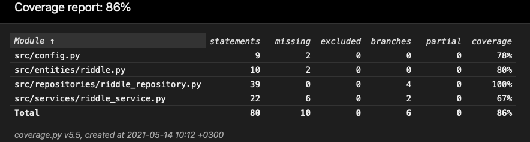

# Testausdokumentti

- Sovelluksen testien haarautumakattavuus on 86%

- Testausta on tehty yksikkö- että integraatiotasolla, eli yksittäisten luokkien sekä luokkien yhdistelmien toiminnallisuutta

- Sovelluslogiikkaa vastaavan luokan RiddleServiceä testataan TestRiddleService-luokalla. Testissä on käytössä FakeRiddleRepository-luokka, jotta voidaan alustaa
RiddleService-olio niin, että voidaan injektoida riippuvuudeksi repositorio-olio

- RiddleRepository-luokkaa testataan TestRiddleRepository-luokassa. Testitiedosto on konfiguroitu .env.test-tiedostoon. 
